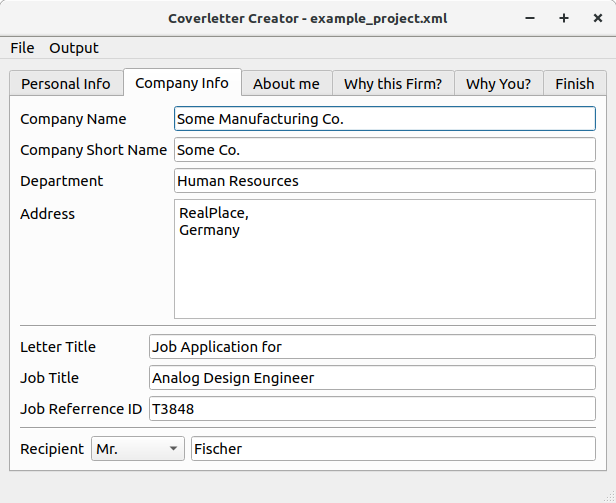

Requirements
============

* Latex (depends on template used), Install using
```console
$ sudo apt install texlive-full
```
* Python 3.6

Python packages:

* Jinja2==2.10.1
* lxml==4.3.3
* pyenchant==2.0.0
* PyQt5==5.12.2
* PyQt5-sip==4.19.17

run in your shell: 
```console
pip install -r requirements.txt 
```

Usage
=====

Starting the app
----------------

Make sure [main.py](main.py) is executable. Run with python3 using the command.

```console
$ python3 main.py
```

How to use
-----------

Start a new project using <kbd>CTRL</kbd>+<kbd>N</kbd> or from ```File > New```.
Enter Personal data in personal data tab.


Add data about the company you are applying to. For example:




Add content to About me, why this firm? and why you? tab as you require. Keep it brief!


Finally in Finish tab add closing salutation and then select attached documents. Then click on `Generate PDF` or `Generate Text` button.


Output
------

Output can be either pdf or text. Output directories can be set using : `Output > Latex > Set Output Directory`or `Output > Text > Set Output Directory`

Example of Generated pdf and [Generated Text] is shown below:


[Generated Text]:(Text/Output/coverletter.txt)

Writing Templates
=================

Templates are based on jinja2 text renderer. For Text templates, the default jinja syntax is used. Refer to [jinja templating documentation](http://jinja.pocoo.org/docs/2.10/templates/) for more details.

The Latex template uses jinja sysntax modifies to fit latex better. Jinja env variables are redifined as follows.

```python
latex_jinja_env = jinja2.Environment(
	block_start_string='\BLOCK{',
	block_end_string='}',
	variable_start_string='\VAR{',
	variable_end_string='}',
	comment_start_string='\#{',
	comment_end_string='}',
	line_statement_prefix='%%',
	line_comment_prefix='%#',
	trim_blocks=True,
	autoescape=False,
	loader=jinja2.FileSystemLoader(os.path.abspath('/'))
)
```

Variables
---------


Variable names that can be used in templates can be easily copied by clicking on the Labels. For example to copy the variable that holds the First name, just click on the label that says "First Name".

Variables can be used as the jinja documentation defines. Along with any control statements.

Example of Variable usage:

Latex:

```latex
\VAR{FIRSTNAME}
```

Text:

```python
{{FIRSTNAME}}
```

Example of control statements:

Latex:

```latex
\VAR{RECEIPIENTSALUTATION} \BLOCK{ if RECEIPIENTGENDER == 'Unknown' }
Sir / Madam
\BLOCK{ else }
\VAR{RECEIPIENTGENDER} \VAR{RECEIPIENTNAME}
\BLOCK{ endif }
,
```

Text:

```python
{{RECEIPIENTSALUTATION}} 
Sir / Madam

{{RECEIPIENTGENDER}} {{RECEIPIENTNAME}}

,
```

See example templates [Latex Template](Latex/Templates/Awesome-CV/Latex_template.tex) and [Text Template](Text/Templates/Simple/Text_template.txt)
